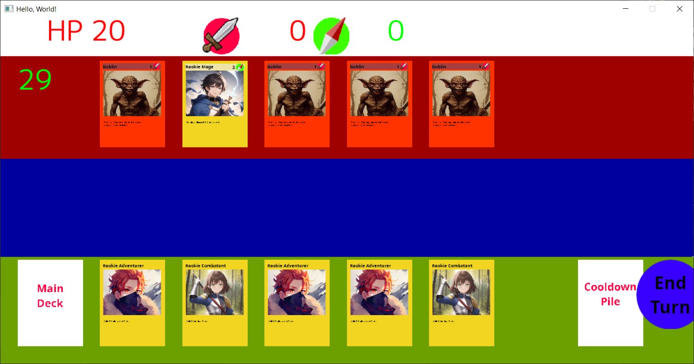

# GuildSim

## Intro

Play as guild manager, dispatch hero to explore area, defeat monster, gains reputation and be the best guild in town

This is just my interpertation of how ascension should be. Their gameplay loop is fine but sometimes I feel the pacing can be chore because no player can acquire cards in center row.

## Objective of the game

Defeat 3 bosses in the game to clear the game, or play the game until the center deck run out

## Gameplay loop

1. explore area to gain reputation, gold, recruit better heroes and unlocks harder monster
2. defeat monsters to gain more reputation. If monsters is not immediately taken care of there will be some side effect each turn
3. once certain conditions are met (reputation level, gold level, deck size etc), boss or mini boss is can appear into the center row to be defeated
4. repeat

## Code
I'll try to make the code as robust as I can. I only have minor experience making game and I don't even know what the game will looks like at the end. Probably over-engineer something for no good reason.

For now I only support textUI only while I'm also planning to make some simple GUI. But I haven't decided what UI framework to choose at the moment

## installation

### TextUI
clone the repo and just run `go build main.go` and run the executable

### GUI
clone the repo and go to ui directory and run `go build -o main *.go`

